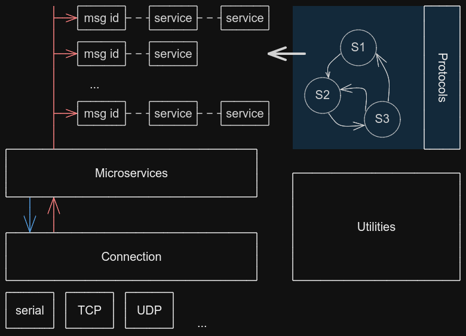

# lw-mavsdk
Lightweight MAVSDK - a pure C library that provides lightweight mavlink communication to a vehicle

## Design



## Build

Clone this repository and then:

```sh
git submodule update --init --recursive
```

Then build with CMake:

```sh
mkdir build
cd build
cmake ..
```

Build the library:

```sh
make lwmavsdk
```

Build the test suite and examples:

```sh
make main-*

make test-*
```
